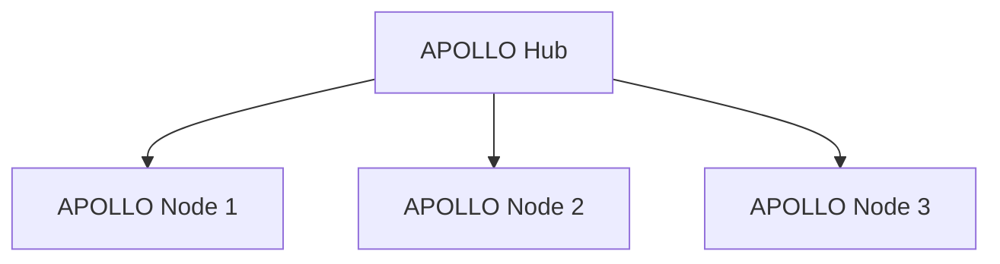

# APOLLO Hub: Minimal Node Coordination Blueprint

The APOLLO Hub is a **lightweight coordination layer** designed to track multiple standalone APOLLO Nodes. It avoids premature complexity and focuses strictly on visibility and basic routing.

## 1. Core Architecture (The Light Hub)

## 2. Minimal Responsibilities

### 🟢 Node Registry (The Source of Truth)
- **Inventory**: Stores a list of active node IPs and their associated secret keys.
- **Identity**: Assigns a simple ID to each node (e.g., `edge-01`, `edge-02`).

### 🟡 Health Monitoring (Visibility Only)
- **Passive Polling**: The Hub periodically calls `GET /metrics` on each registered node.
- **Load Map**: Maintains a simple, in-memory table of current agent counts per node.
- **Availability**: Marks a node as `offline` if the heartbeat fails twice.

### 🔵 Simple Routing (Provider Assistant)
- **Load Balancing**: When asked, returns the IP of the node with the fewest active agents.
- **Status Reporting**: Provides a single JSON endpoint for providers to see the status of their entire fleet.

## 3. What the Hub is NOT (Postponed Features)
To maintain focus on the core execution engine, the following are **EXCLUDED**:
- ❌ **No Billing/Metering**: Left to the provider's existing billing system.
- ❌ **No RBAC/User Management**: The Hub is a machine-to-machine internal tool.
- ❌ **No Automated Orchestration**: The Hub suggests nodes; it does not force deployments.
- ❌ **No Global UI**: Simple JSON API only.

## 4. Operational Flow
1.  **Node Setup**: Provider installs a APOLLO Node and generates a secret key.
2.  **Registration**: Provider adds the Node IP/Key to the APOLLO Hub.
3.  **Polling**: The Hub starts tracking the node's health and load.
4.  **Inquiry**: Provider panel asks the Hub: *"Which node has space for a new agent?"*
5.  **Response**: Hub returns the best Node IP.

## 5. Strategic Status
- **Primary Product**: APOLLO Node (Execution Engine).
- **Secondary Tool**: APOLLO Hub (Coordination Layer).
