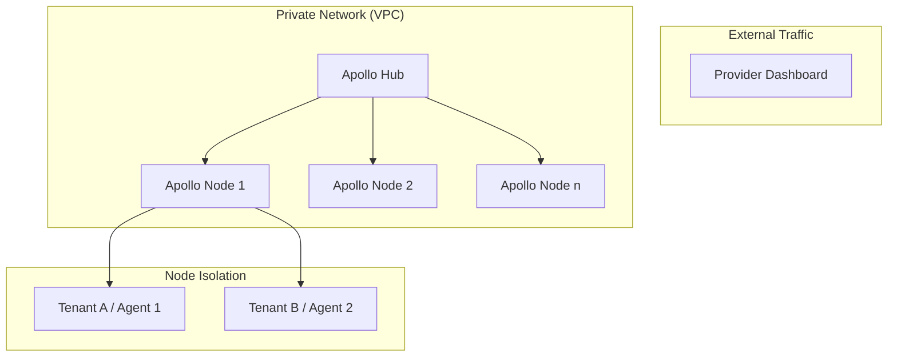

# APOLLO v1.0: Enterprise Approval Pack

This document provides the formal specifications and security guarantees required for enterprise IT approval and SOC2-compliant infrastructure deployment.

## 1. Security & Compliance Checklist
| Requirement | Status | Implementation Detail |
| :--- | :--- | :--- |
| **Identity Isolation** | ✅ | Dedicated `APOLLO_TENANT_ID` and workspace sandboxing. |
| **Process Control** | ✅ | PID-level isolation via Unix Process Groups. |
| **Data Integrity** | ✅ | Atomic JSON state flushing with boot-time reconstruction. |
| **Audit Trail** | ✅ | Deterministic Causal Event Spine (`events.jsonl`). |
| **Auth** | ✅ | Fleet-wide Secret Key rotation support. |
| **Network Safety** | ✅ | Localhost/Private Range blocking and RPS rate-limiting. |

## 2. SOC2-Friendly Summary
APOLLO is designed as an **append-only, event-sourced distributed runtime**. It maintains a persistent audit log of every agent lifecycle transition, ensuring 100% traceability for compliance audits. No agent can access the data or processes of another tenant due to strict path canonicalization and workspace sandboxing.

## 3. Deployment Architecture (Physical)


## 4. Failure Mode & Recovery Analysis (FMEA)
| Failure Scenario | System Response | IT Impact |
| :--- | :--- | :--- |
| **Node Process Kill** | Immediate Hub `OFFLINE` status. | No data loss. |
| **Node Restart** | Pre-flight orphan cleanup + State recovery. | Automatic (0 manual steps). |
| **Hub Downtime** | Nodes continue local execution independently. | Monitoring only. |
| **Disk Saturation** | Log rotation and I/O write-stalling prevention. | Stable degradation. |
| **Network Partition** | Hub-Node circuit breaker triggers `DEGRADED`. | Isolation of faulty segment. |

## 5. Acceptance Standard
To certify an installation, the following command must return all `OK` values:
```bash
apollo doctor
```
> [!IMPORTANT]
> A "PRODUCTION READY" status indicates that the process sandbox, event spine, and state persistence modules are fully initialized and compliant with the v1.0 spec.
